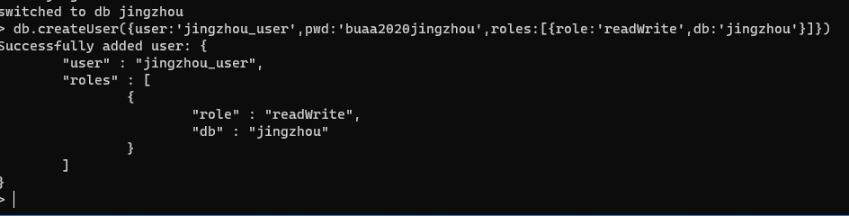

# 内容介绍

这是径舟学术的后端。

## 说明

MySQL需要先建表才能够使用。

建表语句见data.sql

mongoDB配置

要运行项目，请先安装lombok插件（plugin），resource/application.property文件中配置好本地mysql数据相关信息

## 版本

2020/11/10 v0.01 Springboot初始内容，额外多出两个Controller。

2020/12/1 v0.02 MySQL和MongoDB已配置

2020/12/2 v0.03 Swagger2已配置

## 未来技术安排

API的具体编写和完善
